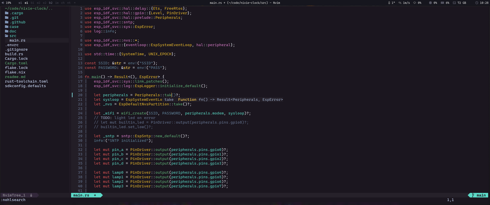

# Joker


Dark colorscheme inspired by Batman: The Animated Series 🖤 with TS and LSP support.

## Install with [home-manager](https://github.com/ksevelyar/idempotent-desktop/blob/main/users/shared.nix)

```nix
  joker-vim = pkgs.vimUtils.buildVimPlugin {
    name = "joker-vim";
    src = pkgs.fetchFromGitHub {
      owner = "ksevelyar";
      repo = "joker.vim";
      rev = "main";
      sha256 = "sha256-YYzU9MyetxZEGVxDEraH7jK/70SCW3Gv57JfUVuQa4A=";
    };
  };
```

```nix
  programs.neovim = {
    enable = true;
    defaultEditor = true;

    plugins = with pkgs.vimPlugins;
      lib.mkDefault [
        # auto load nix flakes
        direnv-vim

        # UI
        indent-blankline-nvim
        lualine-nvim
        nvim-web-devicons

        # Navigation
        telescope-nvim
        plenary-nvim
        nvim-tree-lua
        leap-nvim

        # Git
        vim-fugitive
        gitsigns-nvim

        # LSP & Completion
        nvim-lspconfig
        nvim-cmp
        cmp-nvim-lsp
        cmp-buffer
        cmp-path
        cmp-cmdline
        cmp-vsnip
        vim-vsnip

        # Syntax & Highlighting
        nvim-treesitter.withAllGrammars
        nvim-colorizer-lua
        vim-openscad

        # Themes
        joker-vim
        oxocarbon-nvim
      ];
  };
```
